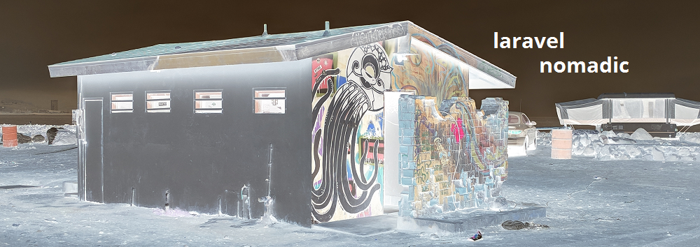
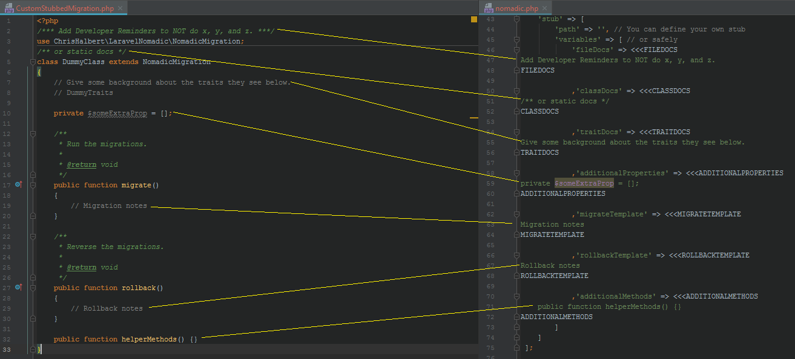
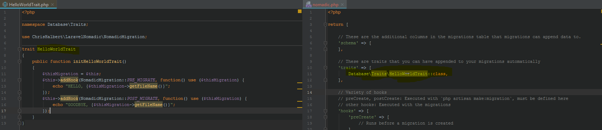

# laravel-nomadic
[](https://travis-ci.org/chrishalbert/laravel-nomadic)
[](https://coveralls.io/github/chrishalbert/laravel-nomadic?branch=master)
[](https://packagist.org/packages/chrishalbert/laravel-nomadic)
[](https://packagist.org/packages/chrishalbert/laravel-nomadic)
[](https://packagist.org/packages/chrishalbert/laravel-nomadic)

A powerful configuration based toolkit of enhancements to Laravel's migrations. This exposes an event driven design so that developers can create reusable functionality that executes automatically using the same developer workflow.

## Features
* [**Hooks**](docs/NomadicHooks.md) - Use pre/post hooks for migration commands: `make:migration`, `migrate`, and `migrate:rollback`

* [**Stubs**](docs/NomadicStubs.md) - Add developer notes to the generated migration

* [**Schema**](docs/NomadicSchema.md) - Associate extra data within your `migrations` table

| id |  migration          | batch | author | comments                   | rollback |
|----|:-------------------:|------:|-------:|---------------------------:|-----------:|
| 1  | 20200811_CreateTable| 1     | John   | Stores data for product x  | NULL                    |
| 2  | 20200812_AddData    | 1     | Jack   | Populate product x features| NULL                    |
| 3  | 20200812_UpdateData | 2     | Jane   | Fix description typo       | {desc: "Grate product."}|

* [**Traits**](docs/NomadicTraits.md) - Add reusable functionality to every migration, via traits. Bonus: You can use hooks here too!


## Installation
1. ```composer require chrishalbert/laravel-nomadic```
2. Add the Service Provider to the config/app.php:
```php
    'providers' => [
        /**
         * Custom Providers...
         */
        ChrisHalbert\LaravelNomadic\NomadicServiceProvider::class,        
    ]
```
3, Publish default configs/nomadic.php: ```php artisan vendor:publish```

## Feature Requests/Bugs
   Submit feature requests or bugs to [laravel-nomadic issues](https://github.com/chrishalbert/laravel-nomadic/issues).
   
## Services
_Do you have an internal need or enhancement you care not to share with the world?_
####I can help! 
Reach out to me directly for rates, scope and your business needs. I can furnish an NDA as needed. 