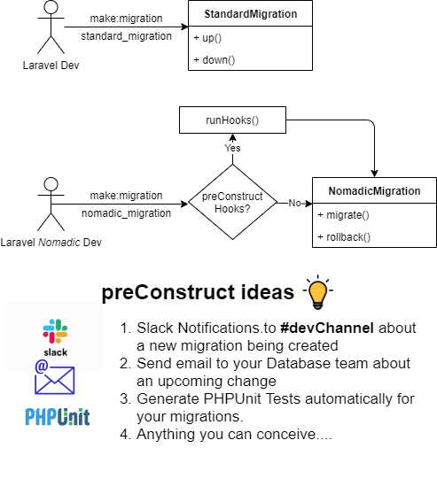
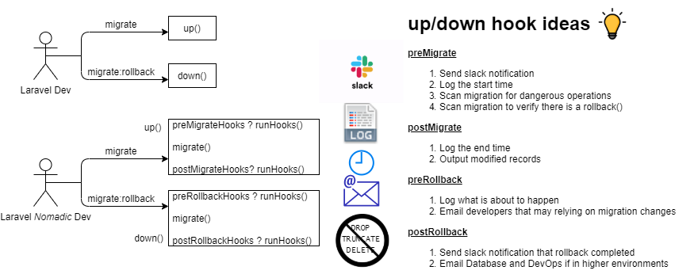

# Nomadic Hooks 
* Use Case: You would like to alert the developer to run all migrations before creating a new one.
* Use Case: After a migration is generated, you want to remind the user to add schema changes to the release notes.


## Usage 
Open up the nomadic.php where you can add 2 different types of hooks. 

### Create Hooks

These are hooks used when you run `php artisan make:migration`. These hooks can ONLY be defined here in the config file. You can pass a closure, or you can pass a NomadicHookInterface. The benefit of passing the NomadicCreateHookInterface, is that you get the same data passed to the create(). These arguments are
passed to the execute() method, which is what is called. 
```
return [
    'hooks' => [
        'preCreate' => [
            function() {
                \Log::info('Make sure to run all migrations');
            },
        ],
        'postCreate' => [
            new NomadicCreateHookInterfaceImplementation()
        ]
    ],
];
```

### Migration Hooks
These hooks are excuted when the migration runs. The construct hook can only be set in the config file. Everything else can be set here in the configuration
or modified at runtime.

```
return [

    // Hooks executed with the migrations
    'hooks' => [
        'construct' => [            	// Can only be defined in the configs
        ],
        'preMigrate' => [ 				// Executed before up()
        ],
        'postMigrate' => [				// Executed after up()
        ],
        'preRollback' => [				// Executed before rolling down()
        ],
        'postRollback' => [				// Executed after rolling down()
        ],
        'destruct' => [					// Executed during destruction
        ]
    ],
];
```